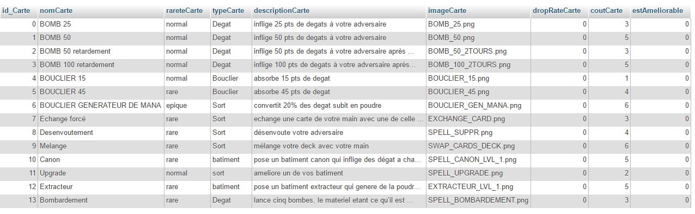

<h1 align="center"> DROP DA BOMB </h1>

## Les cartes du jeu

````

````

<p align="center">
    
</p>

````

````

Ci-dessus la plaquette avec toutes les cartes crées lors de la première et deuxième vague de création de contenus. 

Le bandeau supérieur contient les visuels de cartes "verso", c'est à dire les différents skins que l'on peut appliquer à son deck afin que les cartes en jeu qui sont retournées aient ce skin.

Les cartes de jeu sont toutes represéntées en base de données et possèdent, notamment : un nom, un coût en poudre, une description, une rareté, etc..  

Les cartes sont representées de la manière suivante en Base de données. Nous avons fait le choix de gérer les chemins des images du coté du serveur, afin de n'avoir aucune repercution sur le code en cas de changement de nom ou chemin. 

<p align="center">
    
</p>


*Une description détaillée de chaque carte est en cours d'élaboration et sera fournie dans les semaines à venir.*

---

**Ces cartes ont étés entièrement créees par les membres du groupe et sont donc toutes uniques. Comme le reste du contenu, du code et des différents documents, elles sont la propriété exclusive de DROPDABOMB.**